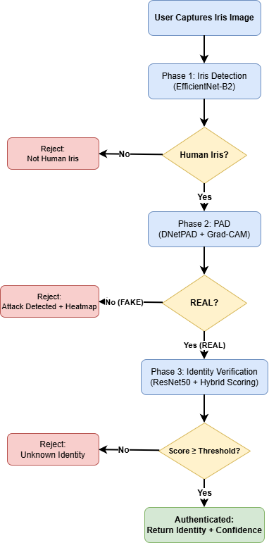
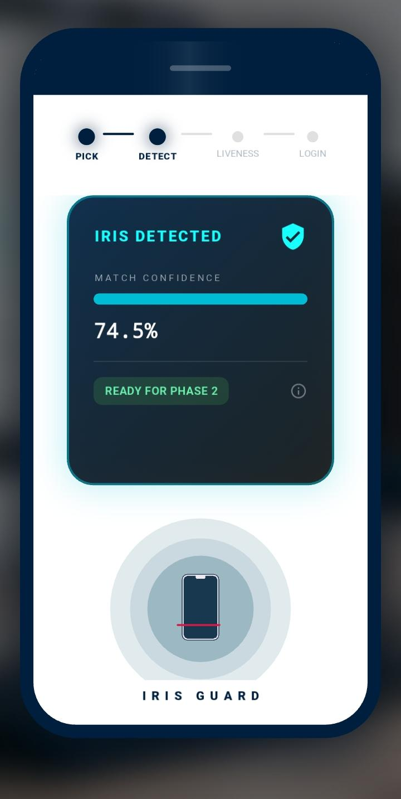
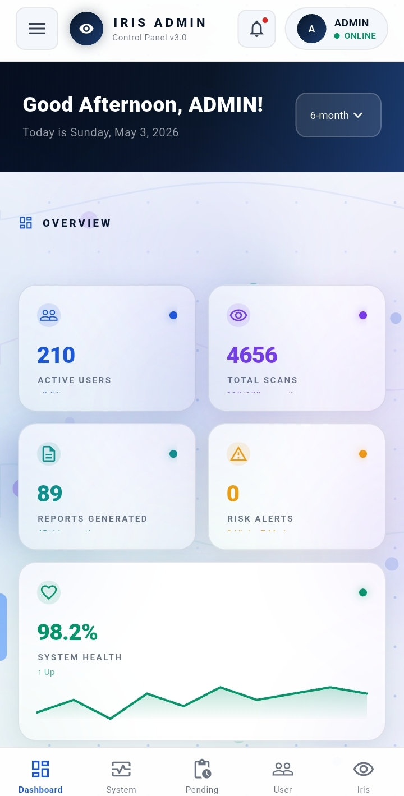
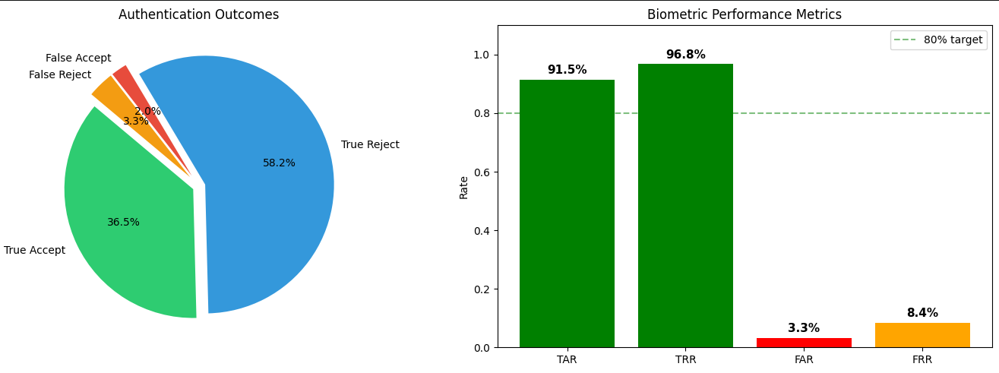

# IrisGuard 🔐👁️

<h1 align="center">
IrisGuard: AI-Powered Robust Iris Biometric Authentication System
</h1>

Multi-Phase Presentation Attack Detection • Explainable AI • Open-Set Recognition • Generative AI • RAG Assistant • Flutter Deployment

---

# 📌 Overview

**IrisGuard** is a research-oriented AI-powered iris biometric authentication framework designed to improve the security, robustness, and interpretability of biometric verification systems.

The system integrates:

- Computer Vision
- Deep Learning
- Explainable Artificial Intelligence (XAI)
- Presentation Attack Detection (PAD)
- Open-Set Identity Verification
- Generative AI
- Retrieval-Augmented Generation (RAG)
- Flutter-based Mobile Deployment

The primary objective of IrisGuard is to develop a secure biometric framework capable of addressing:

- Presentation attacks and spoofing attempts
- Unknown identity rejection
- Real-world environmental variations
- Lack of transparency in AI-based decisions

---

> **Research Notice**
>
> This repository presents a high-level overview of the IrisGuard research project. Detailed methodologies, implementation code, training procedures, datasets, and model weights are intentionally withheld while the accompanying research manuscript is under preparation.

# 🎥 Research Demonstration

The demonstration showcases the complete IrisGuard authentication workflow:

- Iris acquisition
- Deep learning based processing
- Presentation Attack Detection
- Explainable AI visualization
- Identity verification
- RAG-powered AI assistant
- Flutter mobile interface

---

# 🔬 Research Motivation

Traditional biometric authentication systems face several challenges:

- Vulnerability to presentation attacks
- Closed-set recognition limitations
- Limited interpretability of deep learning models
- Difficulty transitioning research models into practical applications

IrisGuard addresses these challenges through a multi-layer AI security pipeline combining robustness, explainability, and deployment.

---

# 🚀 Research Contributions

IrisGuard contributes a unified biometric security framework through:

- Multi-phase Presentation Attack Detection for spoofing resistance
- Open-set recognition for unknown identity rejection
- Explainable AI integration for transparent predictions
- Retrieval-Augmented Generation assistant for intelligent support
- Flutter deployment for real-world mobile authentication

The project bridges the gap between biometric research and practical AI deployment.

---

# 🏗️ System Architecture

The complete authentication pipeline:
Input Iris Image

    ↓

Iris Detection & Processing

    ↓

Presentation Attack Detection

    ↓

Explainable AI Analysis

    ↓

Open-Set Identity Verification

    ↓

Authentication Decision

    ↓

AI Assistant Support

---

# 🛡️ Multi-Phase Security Pipeline

Every authentication request passes through multiple security stages.

## Phase 1 — Iris Detection

The system identifies and processes iris information using deep learning based visual recognition.

## Phase 2 — Presentation Attack Detection

The system detects possible spoofing attempts including:

- Printed iris attacks
- Replay attacks
- Synthetic iris attacks

## Phase 3 — Open-Set Identity Verification

The system distinguishes between:

- Registered identities
- Unknown/unregistered identities

---

# ⚙️ Methodology

The IrisGuard framework follows a sequential AI authentication workflow:

### 1. Image Acquisition

Capture iris input from the user.

### 2. Pre-processing

Enhancement and normalization of iris images.

### 3. Feature Extraction

Deep learning models extract discriminative iris features.

### 4. Presentation Attack Detection

A security layer analyzes whether the input is genuine or spoofed.

### 5. Explainable AI

Grad-CAM based visualization provides insight into model decisions.

### 6. Open-Set Recognition

Unknown identities are rejected instead of forcing incorrect classification.

### 7. Authentication Decision

Final verification decision is generated.

---

# 👁️ Iris Registration

The enrollment module securely registers iris information for future authentication.

---

# ⚙️ Iris Processing Pipeline

Processing stages:

- Image acquisition
- Pre-processing
- Feature extraction
- Deep learning inference
- Authentication decision

---

# 🧿 Liveness Detection & PAD

The system performs liveness analysis to improve resistance against biometric spoofing.

---

# 🧠 Explainable AI (XAI)

IrisGuard integrates Explainable AI techniques to improve model transparency.

The system provides:

- Visual explanation of predictions
- Important feature localization
- Improved model debugging
- Human-interpretable decisions

---

# 🤖 RAG-Powered AI Assistant

The integrated Retrieval-Augmented Generation assistant provides:

- Knowledge-grounded responses
- System explanation
- User assistance
- Interactive AI support

---

# 📱 Flutter Mobile Application

## Login Interface

## Authentication Workflow

## Iris Scanning Interface

## Authentication Result

## Request Approval

---

# 🖥️ Dashboard & Management

## Admin Dashboard

## User Dashboard

The dashboard provides:

- User management
- Authentication monitoring
- Security tracking
- System analytics

---

# 📊 Experimental Evaluation

## ROC Curve

## FAR-FRR Analysis

## Performance Summary

| Metric | Result |
|---|---|
| Iris Detection Accuracy | **99.94%** |
| Presentation Attack Detection EER | **3.25%** |
| Open-Set Verification AUC | **0.9974** |
| GPU Inference Time | **0.15 sec** |

Performance metrics are based on internal experimental evaluation. Detailed dataset information and methodology will be provided in the research manuscript.

---

# 🛠️ Technology Stack

## Artificial Intelligence

- PyTorch
- TensorFlow
- EfficientNet
- ResNet50
- CNN Architectures
- GAN-based Synthetic Data Generation

## Computer Vision

- OpenCV
- Image Processing
- Feature Extraction
- Iris Recognition

## Explainable AI

- Grad-CAM
- Model Interpretation
- Visual Explanation

## Generative AI

- Retrieval-Augmented Generation (RAG)
- Large Language Models
- Synthetic Data Generation

## Application Development

- Flutter
- Firebase
- Android/iOS Deployment

---

# 📄 Research Status

## Manuscript in Preparation

**Research Project Title**

**IrisGuard: A Robust Flutter-Based Biometric Authentication System with Multi-Phase PAD, Explainable AI, Open-Set Recognition, and RAG-Powered Assistant**

The manuscript is currently under preparation by the research team.

---

# 🔒 Code Availability

The implementation is currently private because this project is part of an ongoing research study and manuscript preparation.

This repository contains:

✅ Research overview  
✅ System architecture  
✅ Methodology  
✅ Experimental results  
✅ Demonstration materials  

The complete implementation will be released after publication or with appropriate approval.

---

# 🔮 Future Research Directions

- Large-scale cross-dataset evaluation
- Lightweight edge AI deployment
- Vision-language biometric systems
- Improved adversarial robustness
- Federated biometric learning

---

# 👩‍💻 Research Team

## Authors

- Saleha Arshad
- Omama Sajid
- Seerat-e-Marryum

Computer Science Undergraduate Researchers  
PAF-IAST

### Research Interests

- Computer Vision
- Deep Learning
- Generative AI
- Explainable AI
- AI Safety
- Multi-Agent Systems

📧 Email  
salehaarshad3369@gmail.com

🔗 GitHub  
https://github.com/Saleha198

🔗 LinkedIn  
https://linkedin.com/in/saleha-arshad-08154726a

---

⭐ Building AI systems that are secure, interpretable, and impactful.

