# IrisGuard 🔐👁️

<h1 align="center">
IrisGuard: AI-Powered Robust Iris Biometric Authentication System
</h1>

Multi-Phase Presentation Attack Detection • Explainable AI • Open-Set Recognition • Generative AI • RAG Assistant • Flutter Deployment

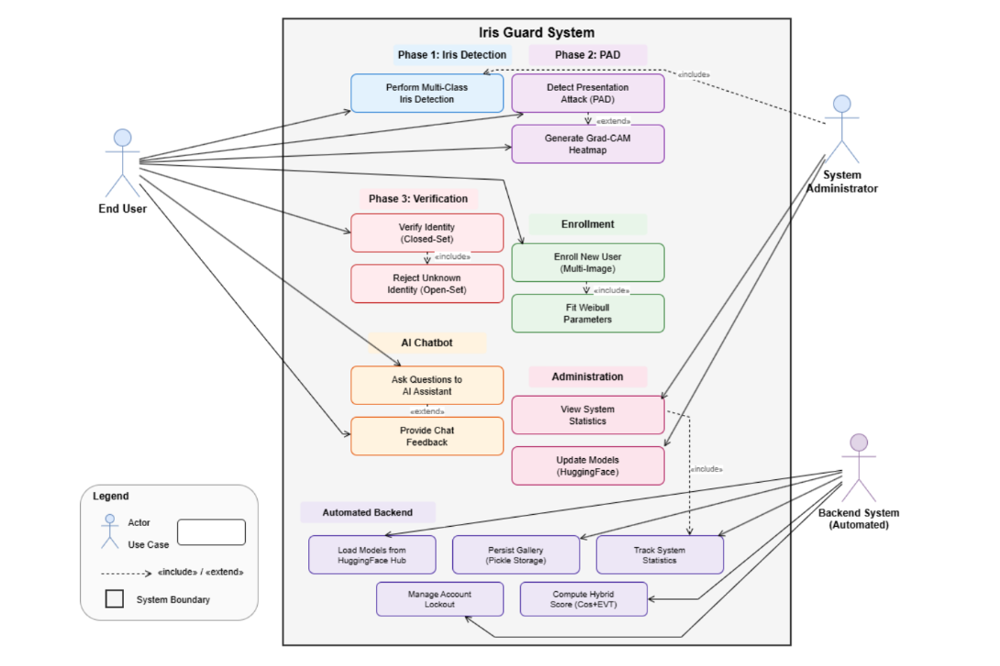

---

# 📌 Overview

**IrisGuard** is a research-oriented AI-powered iris biometric authentication system designed to improve the security, robustness, and interpretability of biometric verification systems.

The system combines:

- Computer Vision
- Deep Learning
- Explainable Artificial Intelligence (XAI)
- Presentation Attack Detection (PAD)
- Open-Set Identity Verification
- Generative AI
- Retrieval-Augmented Generation (RAG)
- Flutter Mobile Application Deployment

The primary objective of IrisGuard is to develop a secure biometric framework capable of handling:

- Spoofing attacks
- Unknown identities
- Real-world environmental variations
- Lack of transparency in AI decisions

---

# 🎥 Demo Video

Click the image above to watch the IrisGuard demonstration.

---

# 🔬 Research Motivation

Traditional biometric authentication systems face challenges such as:

- Vulnerability to presentation attacks
- Closed-set recognition limitations
- Poor interpretability of deep learning models
- Difficulty deploying research models into practical systems

IrisGuard addresses these limitations through a multi-stage AI security pipeline.

---

# 🚀 System Architecture

The complete authentication workflow consists of:

Input Iris Image
|
↓
Iris Detection & Processing
|
↓
Presentation Attack Detection
|
↓
Explainable AI Analysis
|
↓
Open-Set Identity Verification
|
↓
Authentication Decision
|
↓
AI Assistant Support

---

# 🛡️ Multi-Phase Security Pipeline

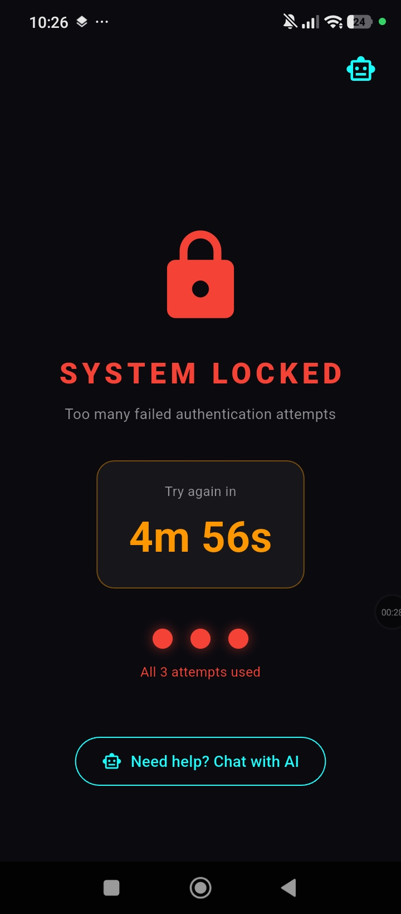

IrisGuard follows a sequential security mechanism where every authentication request passes through multiple verification stages.

## Phase 1 — Iris Detection

The system identifies and processes iris information using deep learning based visual recognition.

## Phase 2 — Presentation Attack Detection

The system detects potential spoofing attempts including:

- Printed iris attacks
- Replay attacks
- Synthetic iris attacks

## Phase 3 — Open-Set Identity Verification

The system supports unknown user rejection by distinguishing between:

- Registered identities
- Unregistered identities

---

# 👁️ Iris Registration

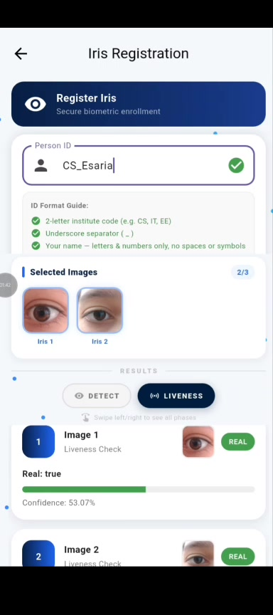

The enrollment module securely registers user iris information for future authentication.

---

# ⚙️ Iris Processing Pipeline

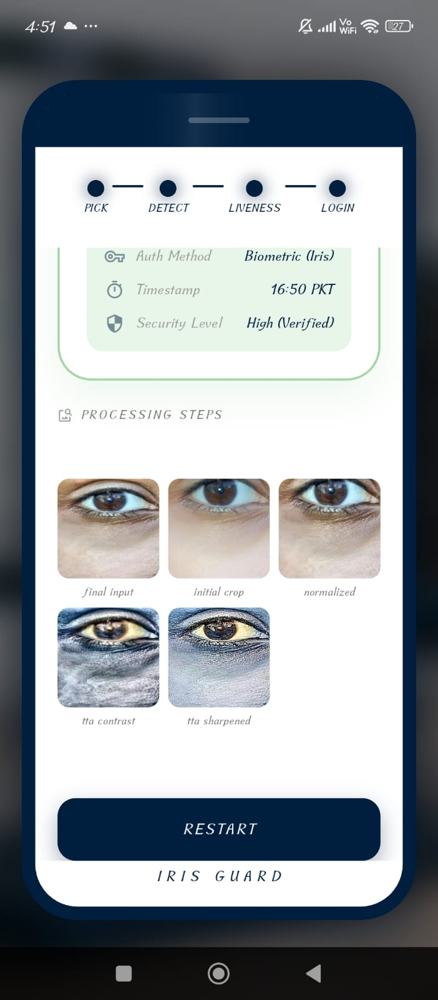

Processing stages include:

- Image acquisition
- Pre-processing
- Feature extraction
- Deep learning inference
- Authentication decision

---

# 🧿 Liveness Detection & PAD

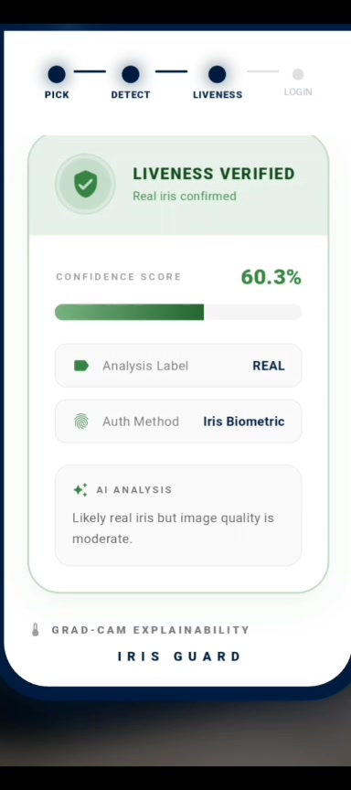

The system performs liveness analysis to improve resistance against biometric spoofing attempts.

---

# 🧠 Explainable AI (XAI)

IrisGuard integrates Explainable AI techniques to improve model transparency.

The system provides interpretable AI decisions by highlighting important visual regions responsible for predictions.

Benefits:

- Trustworthy AI decisions
- Better model understanding
- Improved debugging
- Human-interpretable predictions

---

# 🤖 RAG-Powered AI Assistant

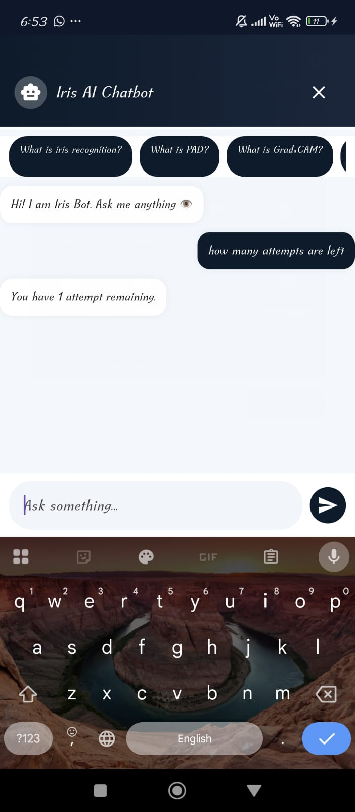

IrisGuard integrates a Retrieval-Augmented Generation assistant to provide intelligent and context-aware support.

Capabilities:

- Knowledge-grounded responses
- User assistance
- System explanation
- Interactive AI support

---

# 📱 Flutter Mobile Application

## Login Interface

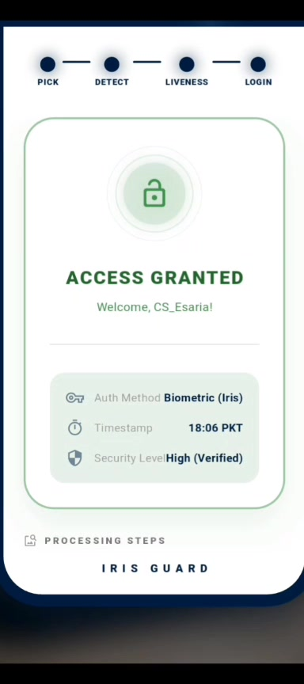

---

## Authentication Workflow

---

## Iris Scanning Interface

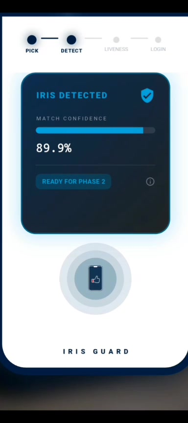

---

## Request Approval

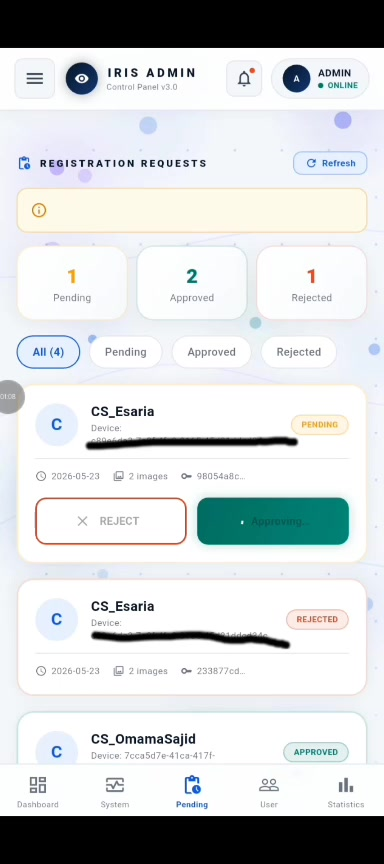

---

# 🖥️ Dashboard & Management

## Admin Dashboard

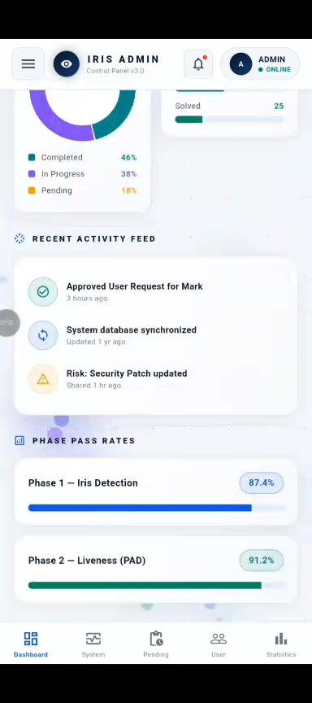

The dashboard enables:

- User management
- Authentication monitoring
- System analytics
- Security tracking

---

# 📊 Experimental Evaluation

## ROC Curve

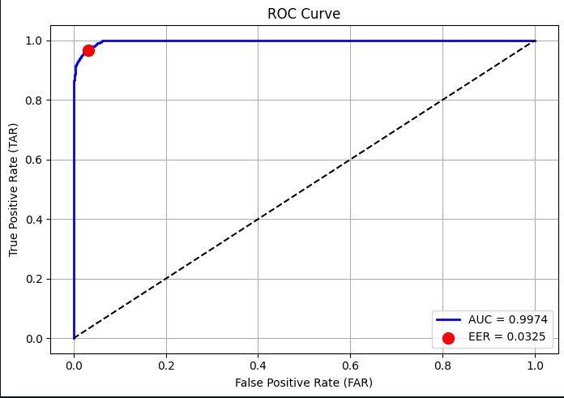

## FAR-FRR Analysis

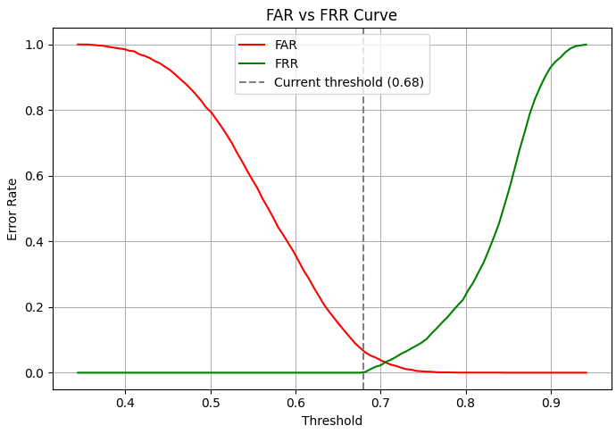

## Performance Summary

| Metric | Result |
|---|---|
| Iris Detection Accuracy | 99.94% |
| Presentation Attack Detection EER | 3.25% |
| Open-Set Verification AUC | 0.9974 |
| GPU Inference Time | 0.15 sec |

---

# 🛠️ Technology Stack

## Artificial Intelligence

- PyTorch
- TensorFlow
- EfficientNet
- ResNet50
- CNN Architectures
- GAN-based Synthetic Data Generation

## Computer Vision

- OpenCV
- Image Processing
- Feature Extraction
- Iris Recognition

## Explainable AI

- Grad-CAM
- Model Interpretation
- Visual Explanation

## Generative AI

- Retrieval-Augmented Generation (RAG)
- Large Language Models
- Synthetic Data Generation

## Application Development

- Flutter
- Firebase
- Android/iOS Deployment

---

# 📄 Research Status

## Manuscript in Preparation

The research manuscript is currently under preparation by the research team.

Project Title:

**IrisGuard: A Robust Flutter-Based Biometric Authentication System with Multi-Phase PAD, Explainable AI, Open-Set Recognition, and RAG-Powered Assistant**

# 🔒 Code Availability

The source code is currently private because this project is part of an ongoing research study and manuscript preparation.

This repository contains:

✅ Research overview  
✅ System architecture  
✅ Methodology  
✅ Experimental results  
✅ Demonstration materials  

The implementation will be released after publication or with appropriate approval.

---

# 🔮 Future Work

Future research directions:

- Large-scale cross-dataset evaluation
- Lightweight edge AI deployment
- Vision-language biometric systems
- Improved adversarial robustness
- Federated biometric learning

---

# 👩‍💻 Research Team

## Authors

- Saleha Arshad
- Omama Sajid
- Seerat-e-Marryum

Computer Science Undergraduate Researchers  
PAF-IAST

### Research Interests

- Computer Vision
- Deep Learning
- Generative AI
- Explainable AI
- AI Safety
- Multi-Agent Systems

📧 Email  
salehaarshad3369@gmail.com

🔗 GitHub  
https://github.com/Saleha198

🔗 LinkedIn  
https://linkedin.com/in/saleha-arshad-08154726a

---

⭐ Building AI systems that are secure, interpretable, and impactful.

